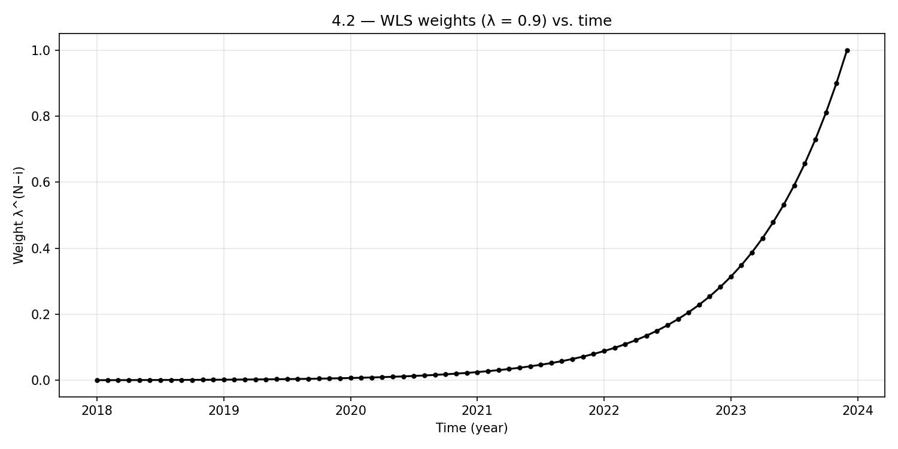
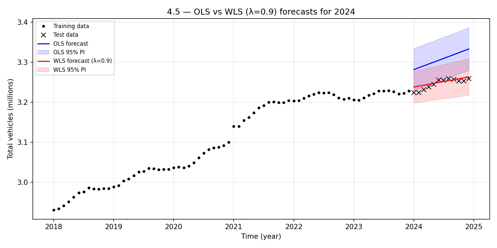
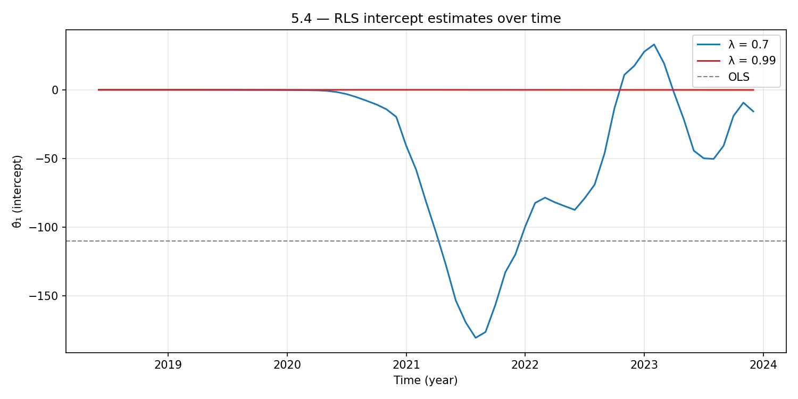
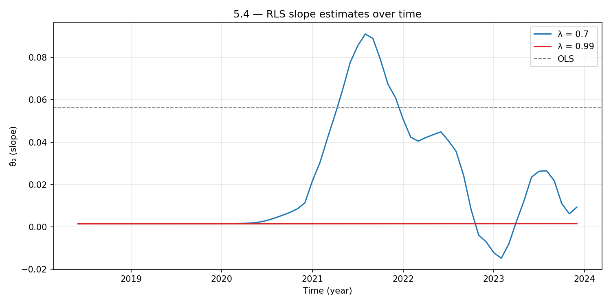
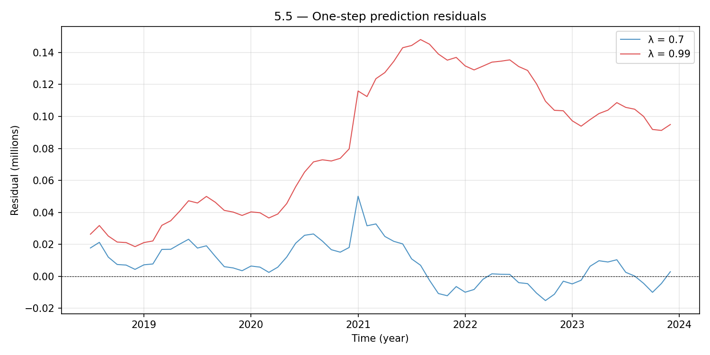
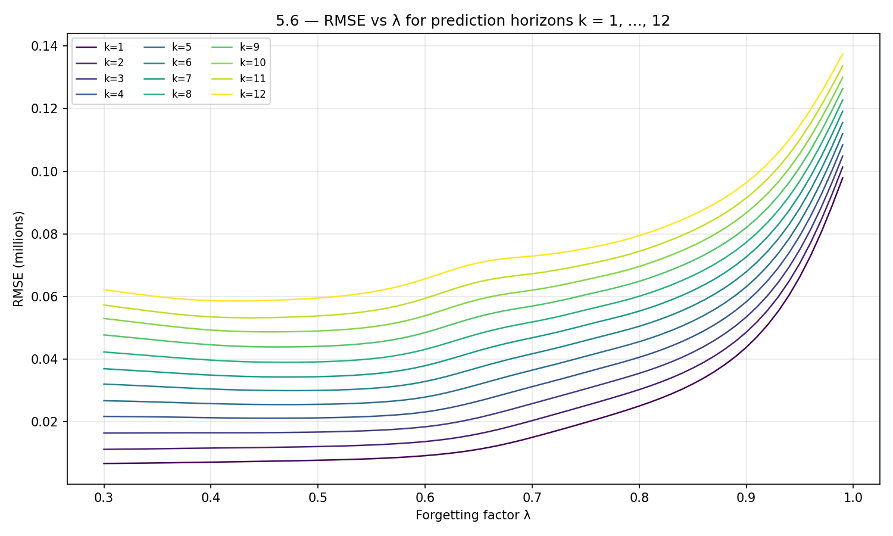
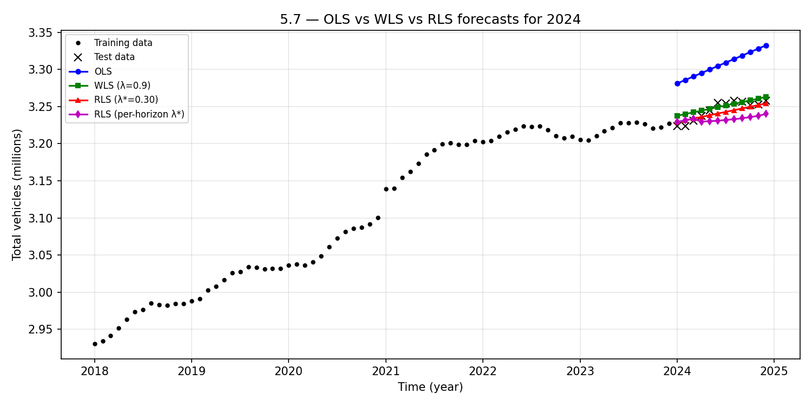

# Assignment 1 — Notes

## 1. Plot Data

### 1.1 Time variable and plot
- Time variable x: 2018-Jan = 2018.000, 2018-Feb = 2018.083, ..., 2023-Dec = 2023.917
- Total vehicles converted to millions (divided by 1e6)
- Training set: x < 2024 (72 months), Test set: x >= 2024 (12 months)
- Plot saved as `plot_1_1.png`

### 1.2 Description of the time series
- **Overall trend:** Clear upward trend from ~2.93M to ~3.23M vehicles over 2018–2023, an increase of roughly 300,000 vehicles (~10%)
- **Growth rate change:** Growth is roughly linear 2018–2020, then accelerates sharply in early 2021 (a jump of ~40,000 in one month), after which it levels off into a slower/plateauing trend from 2022 onward
- **Seasonality:** A mild seasonal pattern is visible — slight increases in spring/summer months and small dips in autumn/winter (likely corresponding to registration/deregistration cycles)
- **No obvious outliers** beyond the 2021 jump, which may reflect a change in registration methodology or a real surge in new registrations

## 2. Linear Trend Model

### 2.1 Matrix form (first 3 time points)

Model: Y_t = θ₁ + θ₂·x_t + ε_t

**Generic matrix form:**
```
Y = Xθ + ε
```

**With symbolic elements:**
```
⎡Y₁⎤   ⎡1  x₁⎤ ⎡θ₁⎤   ⎡ε₁⎤
⎢Y₂⎥ = ⎢1  x₂⎥ ⎢  ⎥ + ⎢ε₂⎥
⎣Y₃⎦   ⎣1  x₃⎦ ⎣θ₂⎦   ⎣ε₃⎦
```

**With actual values (3 digits):**
```
⎡2.930⎤   ⎡1  2018.000⎤ ⎡θ₁⎤   ⎡ε₁⎤
⎢2.934⎥ = ⎢1  2018.083⎥ ⎢  ⎥ + ⎢ε₂⎥
⎣2.941⎦   ⎣1  2018.167⎦ ⎣θ₂⎦   ⎣ε₃⎦
```

Each group member writes this by hand and includes a photo in the report.

## 3. OLS — Global Linear Trend Model

### 3.1 OLS estimation

Method: Minimize sum of squared residuals → closed-form solution θ̂ = (X'X)⁻¹X'y

Results:
- θ̂₁ (intercept) = **-110.355428**
- θ̂₂ (slope) = **0.056145** (millions of vehicles per year, i.e. ~56,100 vehicles/year)
- σ² = 6.828e-04
- σ = 0.02613

### 3.2 Parameter estimates with standard errors

| Parameter | Estimate | Std Error |
|-----------|----------|-----------|
| θ̂₁ (intercept) | -110.3554 | 3.5936 |
| θ̂₂ (slope) | 0.056145 | 0.001778 |

- Covariance matrix: Cov(θ̂) = σ² · (X'X)⁻¹, std errors are sqrt of diagonal
- Plot `plot_3_2.png`: training data with OLS regression line overlaid
- The line fits well in 2018–2020 but undershoots 2021 and overshoots 2022–2023 due to the non-linear growth pattern

### 3.3 Forecast table (2024, test set)

| Month | Predicted | Lower 95% | Upper 95% |
|-------|-----------|-----------|-----------|
| Jan | 3.2812 | 3.2276 | 3.3347 |
| Feb | 3.2858 | 3.2322 | 3.3395 |
| Mar | 3.2905 | 3.2368 | 3.3442 |
| Apr | 3.2952 | 3.2414 | 3.3489 |
| May | 3.2999 | 3.2460 | 3.3537 |
| Jun | 3.3045 | 3.2507 | 3.3584 |
| Jul | 3.3092 | 3.2553 | 3.3632 |
| Aug | 3.3139 | 3.2599 | 3.3679 |
| Sep | 3.3186 | 3.2645 | 3.3727 |
| Oct | 3.3233 | 3.2691 | 3.3774 |
| Nov | 3.3279 | 3.2737 | 3.3822 |
| Dec | 3.3326 | 3.2783 | 3.3869 |

- Prediction variance: σ² · (1 + x'(X'X)⁻¹x) for each test point
- 95% intervals use t-distribution with N-2 = 70 degrees of freedom

### 3.4 Forecast plot
- Plot `plot_3_4.png`: training data, OLS line extended, forecast (red triangles), actual test data (blue squares), and 95% prediction band
- The OLS forecast clearly overshoots — it predicts ~3.28–3.33M but actual values are ~3.22–3.26M

### 3.5 Comment on forecast
- Test RMSE = **0.0617** million vehicles (~61,700 vehicles)
- Mean absolute error = **0.0612** million
- The forecast is **not good** — the linear model extrapolates the average growth rate from 2018–2023, but the actual trend has flattened since 2022. The OLS model overestimates because it weights all historical data equally, including the steep growth in 2018–2021 which no longer represents recent dynamics.
- The actual test values fall mostly outside or near the edge of the 95% prediction intervals.

### 3.6 Residual diagnostics
Plot `plot_3_6.png` — four diagnostic plots:

- **Residuals vs time:** Clear systematic pattern — residuals are negative early (2018–2020), become positive around 2021, then turn negative again. This is not random scatter; it shows the linear model doesn't capture the changing growth rate.
- **Residuals vs fitted:** Same non-random pattern (curved), confirming model misspecification.
- **Q-Q plot:** Deviations from normality in the tails — the residuals are not perfectly normally distributed.
- **ACF plot:** Very high autocorrelation at all lags (ACF > 0.9 at lag 1), decaying slowly. This strongly violates the i.i.d. assumption — residuals are highly correlated over time.

**Conclusion:** The model assumptions are **not fulfilled**. The residuals show systematic structure (non-zero mean pattern), non-normality, and strong autocorrelation. A simple global linear trend is insufficient for this data.

## 4. WLS Local Linear Trend Model

### Overview

We now fit the same linear trend model Y_t = θ₁ + θ₂·x_t + ε_t, but using **Weighted Least Squares (WLS)** to make it *local* — recent observations matter more than older ones. The forgetting factor is λ = 0.9.

---

### 4.1 Variance-Covariance Matrix

The WLS weight for observation i (i = 1, …, N) is:

```
w_i = λ^(N−i)
```

This means the most recent observation (i = N) has weight λ⁰ = 1, while the oldest (i = 1) has weight λ^(N−1) = 0.9^71 ≈ 5.6 × 10⁻⁴.

The **weight matrix** W is N × N diagonal:

```
        ⎡λ^(N-1)   0      ⋯    0  ⎤
W  =    ⎢  0     λ^(N-2)  ⋯    0  ⎥
        ⎢  ⋮       ⋮      ⋱    ⋮  ⎥
        ⎣  0       0      ⋯    1  ⎦
```

Specifically for our 72 × 72 matrix:
- W[1,1] = 0.9^71 = 5.64 × 10⁻⁴ (oldest — Jan 2018)
- W[71,71] = 0.9^1 = 0.90
- W[72,72] = 0.9^0 = 1.00 (most recent — Dec 2023)

**Comparison with OLS:** In the global OLS model the variance-covariance matrix of the errors is Σ_OLS = σ²·I, so every observation has equal influence. In the local WLS model, Σ_WLS = σ²·W⁻¹, which means older observations have *larger* variance (less certainty) and contribute less to the fit. The model effectively "forgets" old data, focusing on the recent trend.

---

### 4.2 λ-Weights vs. Time



The plot shows exponential growth of the weights toward the present. With λ = 0.9, data older than about 2 years (roughly 20 months back, since 0.9^20 ≈ 0.12) contributes very little.

**The most recent time point (Dec 2023, x = 2023.917) has the highest weight of 1.0.**

---

### 4.3 Sum of λ-Weights

The sum of all weights is a geometric series:

```
Σ w_i = Σ_{k=0}^{N-1} λ^k = (1 − λ^N) / (1 − λ) = (1 − 0.9^72) / 0.1 = 9.9949
```

For comparison, the OLS sum of weights is simply N = 72 (each observation has weight 1).

The **effective sample size** of the WLS model is ≈ 10, much smaller than 72. This means WLS is essentially fitting a line through only the most recent ~10 "equivalent" observations, making it far more responsive to recent changes in the trend.

---

### 4.4 WLS Parameter Estimates (λ = 0.9)

Using the WLS formula θ̂_WLS = (X'WX)⁻¹ X'Wy:

| Parameter | OLS | WLS (λ = 0.9) |
|-----------|-----|----------------|
| θ̂₁ (intercept) | −110.355428 | −52.482862 |
| θ̂₂ (slope) | 0.056145 | 0.027530 |
| σ² | 6.828 × 10⁻⁴ | 3.415 × 10⁻⁴ |
| σ | 0.02613 | 0.01848 |

**Interpretation:** The WLS slope (0.0275, i.e. ~27,500 vehicles/year) is much lower than the OLS slope (0.0561, i.e. ~56,100 vehicles/year). This makes sense: the recent trend (2022–2023) shows the growth rate slowing/plateauing, while OLS is heavily influenced by the steep increase around 2021. WLS captures the *current* local trend better.

---

### 4.5 Forecast for 2024 and Comparison



Forecasting the next 12 months (Jan–Dec 2024):

| Metric | OLS | WLS (λ = 0.9) |
|--------|-----|----------------|
| RMSE | 0.0617 M | 0.0082 M |
| RMSE (vehicles) | ~61,700 | ~8,200 |

**The WLS model with λ = 0.9 produces dramatically better forecasts** — its RMSE is roughly 7.5× smaller than OLS.

**Why?** The OLS forecast extrapolates the average slope across the entire 2018–2023 period, which includes the steep 2020–2021 growth. This causes it to **overshoot** the actual 2024 values (blue line above the test data). The WLS model, by contrast, focuses on the recent leveling-off trend and produces a gentler slope that matches the 2024 reality much more closely (red line through the test data).

**Conclusion:** For this data, the WLS forecast (λ = 0.9) is clearly preferable, as the time series exhibits a changing growth rate. A global model is too rigid when the underlying dynamics shift over time.

## 5. Recursive Estimation and Optimization of λ

### Overview

Recursive Least Squares (RLS) is an online algorithm that updates parameter estimates one observation at a time, without re-solving the full OLS problem. When combined with a **forgetting factor** λ ∈ (0, 1], it becomes a time-adaptive method: older data is exponentially down-weighted, allowing the model to track changes in the underlying process.

The key RLS update equations are:

```
R_t = λ · R_{t-1} + x_t · x_t^T          (information matrix update)
θ̂_t = θ̂_{t-1} + R_t^{-1} · x_t · e_t    (parameter update)
e_t = Y_t − x_t^T · θ̂_{t-1}              (prediction error)
```

When λ = 1 (no forgetting), RLS converges to the OLS solution. When λ < 1, recent observations receive more weight — identical to WLS at the final time step.

---

### 5.1 & 5.2 — RLS Without Forgetting: Hand Calculation and Verification

**Initial conditions:** R₀ = 0.1·I, θ̂₀ = [0, 0]^T

**First iteration (t = 1):**
- x₁ = [1, 2018.000]^T, Y₁ = 2.930483
- R₁ = 1.0 · R₀ + x₁ · x₁^T:

```
R₁ = [[   1.1000,  2018.0000],
      [2018.0000,  4072324.1000]]
```

- e₁ = Y₁ − x₁^T · θ̂₀ = 2.930483 − 0 = 2.930483
- θ̂₁ = θ̂₀ + R₁⁻¹ · x₁ · e₁ = [0.000001, 0.001452]

**Second iteration (t = 2):**
- x₂ = [1, 2018.083]^T, Y₂ = 2.934044
- R₂ = R₁ + x₂ · x₂^T:

```
R₂ = [[   2.1000,  4036.0833],
      [4036.0833,  8144984.4403]]
```

- θ̂₂ = [0.000000, 0.001453]

**Third iteration (t = 3):**
- θ̂₃ = [−0.000004, 0.001455]

The parameter estimates start near zero (due to θ̂₀ = 0) and gradually converge toward meaningful values as more data is incorporated. The intercept is especially slow to converge because the design matrix is ill-conditioned (x values are ~2018, making x·x^T very large relative to R₀).

---

### 5.3 — RLS at t = N vs OLS: Effect of Initial Values

At the final time step (t = 72), RLS without forgetting should theoretically match OLS. In practice, the initial R₀ acts as a **prior on the information matrix** that biases the result.

| Method | θ̂₁ (intercept) | θ̂₂ (slope) | Δθ̂₁ from OLS | Δθ̂₂ from OLS |
|--------|----------------|-------------|---------------|---------------|
| OLS | −110.355428 | 0.05614456 | — | — |
| RLS (R₀ = 0.1·I) | −0.058319 | 0.00156796 | 1.10 × 10² | 5.46 × 10⁻² |
| RLS (R₀ = 10⁻⁶·I) | −108.307088 | 0.05513101 | 2.05 | 1.01 × 10⁻³ |
| RLS (R₀ = 10⁻⁹·I) | −110.353341 | 0.05614352 | 2.09 × 10⁻³ | 1.03 × 10⁻⁶ |

**Key insight:** With smaller R₀, the prior has less influence and RLS converges closer to OLS. The R₀ = 0.1·I case is severely biased because the prior "information" (0.1 on the diagonal) is not negligible compared to the information accumulated from the data, especially given the ill-conditioned design matrix (x ≈ 2018 amplifies the intercept sensitivity).

In practice, R₀ should be chosen small enough that the prior vanishes after a few observations, or one can use a "burn-in" period and discard early estimates.

---

### 5.4 — RLS With Forgetting Factor

We run RLS with λ = 0.7 (aggressive forgetting) and λ = 0.99 (minimal forgetting).

#### Parameter trajectories





**λ = 0.7 (blue):** The parameters are highly reactive. The slope θ̂₂ shows the changing dynamics clearly:
- **2018–2020:** Low slope (~0.002), slow growth period
- **2021:** Slope spikes to ~0.09, capturing the sharp acceleration in registrations
- **2022:** Slope drops as growth decelerates
- **2023:** Slope goes briefly negative then recovers — the plateau/slight decline phase

This is exactly the behavior we'd expect: with λ = 0.7, the effective memory is only ~3 observations (1/(1−0.7) ≈ 3.3), so the model aggressively tracks local changes.

**λ = 0.99 (red):** Parameters barely move from their initial values. With λ = 0.99, the effective memory is ~100 observations — longer than our dataset — so the R₀ prior dominates and the model behaves almost like a constant. This is an artifact of the large R₀ = 0.1·I; with a smaller R₀, the λ = 0.99 curve would be closer to OLS.

#### RLS vs WLS at t = N

| λ | RLS θ̂_N | WLS θ̂ | Match? |
|---|---------|--------|--------|
| 0.7 | [−15.740, 0.00937] | [−15.740, 0.00937] | Yes (Δ ≈ 10⁻⁴) |
| 0.99 | [−0.081, 0.00159] | [−107.098, 0.05453] | No — R₀ dominates |

For λ = 0.7, RLS and WLS match closely because the aggressive forgetting quickly washes out the R₀ prior. For λ = 0.99, the slow forgetting means R₀ persists, creating a large discrepancy.

---

### 5.5 — One-Step Predictions and Residuals

The one-step prediction uses the *current* parameter estimate to predict the *next* observation:

```
ŷ_{t+1|t} = x_{t+1}^T · θ̂_t
ε_{t+1|t} = Y_{t+1} − ŷ_{t+1|t}
```



| λ | 1-step RMSE (after burn-in) |
|---|---------------------------|
| 0.7 | 0.014932 |
| 0.99 | 0.094354 |

**λ = 0.7 residuals (blue):** Small and centered around zero, with slight positive bias in 2018–2020 and some oscillation in 2022–2023. The model tracks the data well.

**λ = 0.99 residuals (red):** Large and systematically positive, especially after the 2021 acceleration. The model is too slow to adapt — it keeps predicting based on the early (low) trend and consistently undershoots the actual values. This confirms that λ = 0.99 with R₀ = 0.1·I is essentially a poor static model.

The one-step residuals serve as a built-in **cross-validation** mechanism: they evaluate each prediction using only past data, avoiding look-ahead bias.

---

### 5.6 — Optimize λ for Prediction Horizons k = 1, …, 12

For each horizon k, we compute the k-step prediction residual:

```
ε_{t|t-k} = Y_t − x_t^T · θ̂_{t-k}
```

and find the λ that minimizes the training RMSE over a grid λ ∈ {0.30, 0.31, …, 0.99}.



| Horizon k | Optimal λ* | RMSE |
|-----------|-----------|------|
| 1 | 0.30 | 0.006651 |
| 2 | 0.30 | 0.011162 |
| 3 | 0.30 | 0.016358 |
| 4 | 0.46 | 0.021114 |
| 5 | 0.47 | 0.025461 |
| 6 | 0.48 | 0.029925 |
| 7 | 0.47 | 0.034275 |
| 8 | 0.47 | 0.038968 |
| 9 | 0.46 | 0.043870 |
| 10 | 0.45 | 0.048693 |
| 11 | 0.44 | 0.053182 |
| 12 | 0.42 | 0.058537 |

**Observations:**
- **Short horizons (k = 1–3)** prefer very aggressive forgetting (λ* = 0.30), because the best short-term prediction uses only the most recent local trend.
- **Longer horizons (k = 4–12)** prefer moderate forgetting (λ* ≈ 0.42–0.48). Longer forecasts need a slightly more stable estimate — too much forgetting causes the parameters to oscillate, hurting multi-step predictions.
- **All optimal λ values are well below 0.9**, indicating that this time series has significant non-stationarity that benefits from short memory.
- RMSE increases monotonically with horizon, as expected — longer-term predictions are inherently less accurate.

---

### 5.7 — Test Set Predictions (2024)

We compare four forecasting approaches on the 12-month test set:

| Method | Test RMSE (millions) | Test RMSE (vehicles) |
|--------|---------------------|---------------------|
| OLS | 0.061672 | ~61,700 |
| WLS (λ = 0.9) | 0.008213 | ~8,200 |
| RLS (λ* = 0.30, single) | 0.007940 | ~7,900 |
| RLS (per-horizon optimal λ) | 0.016868 | ~16,900 |



**Analysis:**

- **OLS (blue)** massively overshoots — it extrapolates the average 2018–2023 slope, which is too steep for the current plateau phase. RMSE = 61,700 vehicles.

- **WLS λ = 0.9 (green)** and **RLS λ* = 0.30 (red)** are the best performers, both with RMSE ~8,000 vehicles. They capture the recent flattening trend and produce forecasts that track the test data closely.

- **RLS per-horizon optimal (magenta)** performs worse (RMSE = 16,900) despite being optimized on training data. This is likely due to **overfitting**: the per-horizon λ values were tuned on in-sample k-step residuals, and the very aggressive forgetting (λ = 0.30) that works well for in-sample 1-step predictions doesn't generalize as well to the out-of-sample test period where the single-λ approach uses a consistent model.

**Best choice:** WLS (λ = 0.9) or RLS (λ* = 0.30) — both achieve comparable accuracy. WLS is simpler (batch method), while RLS has the advantage of being online and updatable.

---

### 5.8 — Reflections on Time-Adaptive Models

#### The bias-variance trade-off in forgetting

The choice of λ represents a fundamental trade-off:
- **Small λ (aggressive forgetting):** Short memory → model tracks local changes quickly → low bias but high variance (noisy estimates, sensitive to individual observations)
- **Large λ (slow forgetting) / OLS (λ = 1):** Long memory → stable estimates → low variance but high bias (cannot capture regime changes or non-stationarity)

For this vehicle registration dataset, the growth pattern changed significantly over 2018–2023 (acceleration in 2021, then plateau). This non-stationarity means time-adaptive methods (WLS, RLS with forgetting) dramatically outperform the static OLS approach.

#### Practical considerations
- **λ depends on the horizon:** Short-term forecasts benefit from aggressive forgetting, while longer-term forecasts need more stability
- **Initial conditions matter:** R₀ and θ̂₀ can heavily bias RLS results, especially with large λ. A burn-in period or careful initialization is essential
- **One-step residuals as diagnostics:** The sequence of prediction errors provides a natural model validation tool without requiring a held-out set

#### Beyond RLS
More sophisticated time-adaptive methods include:
- **Kalman filter / state-space models** — the parameters become latent states with explicit dynamics, allowing principled uncertainty quantification (covered in Weeks 10–11)
- **Exponential smoothing** — a family of methods (Holt, Holt-Winters) that can handle trends and seasonality
- **ARIMA/ARMAX models** — explicitly model the autocorrelation structure in residuals (covered in Weeks 5–7)

The key takeaway is that **a single global linear model is insufficient** for this data. Time-adaptive methods that can track evolving dynamics are essential for accurate forecasting.
